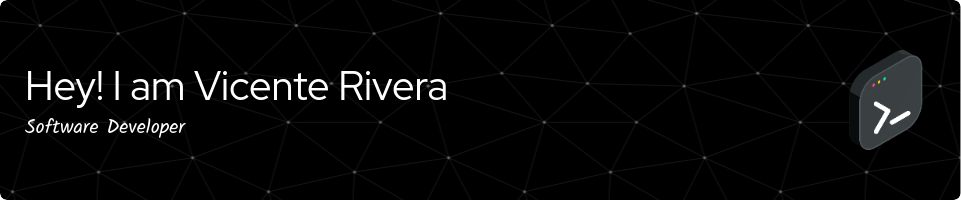

## About me

- 📚 Estudiante de Ingeniería Informática.
<!-- - 🔭 I’m currently working on [url-shortener](https://github.com/vcntttt/url-shortener) -->

<!-- - 🌱 Actualmente estoy aprendiendo **NextJS** -->
<!-- - 👨‍💻 All of my projects are available at [portfolio.link](portfolio.link) -->

## 🧑🏻‍💻 Tech Stack

<!-- Profile views counter

  
 -->

<!-- medallas

  

-->

<!-- github stats

&nbsp;
 -->

<!-- racha

 -->
